# CheckPro — Automated Cheque Extraction

Extract structured data from scanned cheque PDFs using **OpenCV detection**, **triple-engine OCR** (Tesseract + NuMarkdown + Gemini Flash), and **hybrid cross-validation**.

[](https://railway.app/template/checkpro)

**[📖 Full Deployment Guide](DEPLOY.md)** | **[🚀 Quick Start](#quick-start)** | **[📚 API Docs](#api-reference)**

---

## How It Works


### Processing Flow (detailed)

```mermaid
sequenceDiagram
    participant U as User (Browser)
    participant F as Frontend (Next.js :3080)
    participant B as Backend (FastAPI :3090)
    participant S as Supabase (DB + Storage)

    U->>F: Upload PDF
    F->>B: POST /api/upload-analyze
    B->>B: pdf2image (Poppler) → page images
    B->>B: OpenCV detect cheque regions
    B->>B: Crop individual cheque images
    B-->>S: Store PDF + images in Storage
    B-->>F: Return job_id + page/cheque info

    U->>F: Click "Start Extraction"
    F->>B: POST /api/start-extraction
    B->>B: Run Tesseract + NuMarkdown + Gemini in parallel
    B->>B: Cross-validate → hybrid merge (best value per field)
    B-->>S: Save checks_data JSONB + flatten to checks table
    B-->>F: Job complete

    U->>F: Review extracted data
    F->>B: GET /api/jobs/{id}
    U->>F: Export
    F->>B: GET /api/jobs/{id}/export?format=csv
```



---

## Features

- **Smart Layout Detection** — auto-detects bordered contours vs line-grid cheque formats
- **Triple OCR** — Tesseract, NuMarkdown, and Gemini 2.5 Flash run in parallel
- **Hybrid Merge** — cross-validates all engines, picks best value per field with confidence scores
- **Engine Comparison** — side-by-side view of what each OCR engine extracted
- **Multi-format Export** — CSV, QuickBooks IIF, QuickBooks Online, Xero, Zoho, Sage
- **Duplicate Detection** — MD5 hash prevents re-uploading the same PDF
- **Retry Failed** — re-extract only cheques that failed (e.g. API timeout)
- **Supabase Integration** — auth, database, file storage, row-level security
- **Docker Ready** — one-command production deployment

---

## Tech Stack

| Layer | Technology |
|-------|-----------|
| **Frontend** | Next.js 14, React 18, TailwindCSS, Lucide icons |
| **Backend** | Python 3.10+, FastAPI, OpenCV, pdf2image |
| **OCR** | Tesseract (local), NuMarkdown (HuggingFace), Gemini 2.5 Flash (Google) |
| **Database** | Supabase — PostgreSQL + Auth + Storage |
| **Deployment** | Docker Compose, or manual on any VPS |

---

## Prerequisites

| Dependency | Version | Purpose |
|------------|---------|---------|
| **Python** | 3.9+ | Backend server + OCR |
| **Node.js** | 18+ | Frontend |
| **Tesseract OCR** | 5+ | Local OCR engine |
| **Poppler** | any | PDF → image conversion (`pdftoppm`) |
| **Supabase** project | — | Auth + DB + Storage (free tier works) |
| **Gemini API key** | — | AI OCR engine (free: 15 req/min) |

### Installing Tesseract

<details>
<summary><strong>macOS</strong></summary>

```bash
brew install tesseract
```
</details>

<details>
<summary><strong>Ubuntu / Debian</strong></summary>

```bash
sudo apt update
sudo apt install -y tesseract-ocr tesseract-ocr-eng
```
</details>

<details>
<summary><strong>Windows</strong></summary>

**Option A — Chocolatey:**
```powershell
choco install tesseract
```

**Option B — Manual installer:**
1. Download from [UB-Mannheim/tesseract](https://github.com/UB-Mannheim/tesseract/wiki)
2. Run the installer (default path: `C:\Program Files\Tesseract-OCR\`)
3. **Add to PATH**: System Settings → Environment Variables → Path → Add `C:\Program Files\Tesseract-OCR`
4. Restart your terminal

**Verify:**
```powershell
tesseract --version
# Should print: tesseract 5.x.x
```
</details>

### Installing Poppler

Poppler provides `pdftoppm` which converts PDF pages to images. **This is required.**

<details>
<summary><strong>macOS</strong></summary>

```bash
brew install poppler
```
</details>

<details>
<summary><strong>Ubuntu / Debian</strong></summary>

```bash
sudo apt update
sudo apt install -y poppler-utils
```
</details>

<details>
<summary><strong>Windows</strong></summary>

**Option A — Chocolatey:**
```powershell
choco install poppler
```

**Option B — Manual download:**
1. Download the latest release from [oschwartz10612/poppler-windows](https://github.com/oschwartz10612/poppler-windows/releases)
2. Extract the ZIP (e.g. to `C:\poppler\`)
3. **Add to PATH**: System Settings → Environment Variables → Path → Add `C:\poppler\Library\bin`
4. Restart your terminal

**Option C — Already bundled:**
The repo includes Poppler for Windows at `backend/poppler/`. The backend auto-detects it.

**Verify:**
```powershell
pdftoppm -v
# Should print: pdftoppm version 24.x.x
```
</details>

---

## Quick Start

### 1. Clone & configure

```bash
git clone https://github.com/imodoiepale/cheque-extractor.git
cd cheque-extractor
cp .env.example .env
```

Edit `.env` with your credentials:
```env
NEXT_PUBLIC_SUPABASE_URL=https://your-project.supabase.co
NEXT_PUBLIC_SUPABASE_ANON_KEY=your-anon-key
SUPABASE_SERVICE_ROLE_KEY=your-service-role-key
GEMINI_API_KEYS=your-gemini-key
NEXT_PUBLIC_BACKEND_URL=http://localhost:3090
```

### 2. Set up Supabase database

1. Go to [Supabase Dashboard](https://supabase.com/dashboard) → SQL Editor
2. Paste and run `supabase/migrations/001_schema.sql` (for fresh projects)
3. Or run `supabase/migrations/002_patches.sql` (for existing projects — safe to re-run)

### 3. Install & run

**Using setup script (recommended):**
```bash
# Linux/macOS
bash scripts/setup.sh

# Windows
powershell -ExecutionPolicy Bypass -File scripts\setup.ps1
```

**Or manually:**

```bash
# Backend
cd backend
pip install -r requirements.txt
python api_server.py
# → Runs on http://localhost:3090

# Frontend (new terminal)
cd frontend
npm install
npm run dev
# → Runs on http://localhost:3080
```

### 4. Use the app

1. Open **http://localhost:3080**
2. Sign up / log in (Supabase Auth)
3. **Upload** a cheque PDF
4. **Process** → watch real-time detection + OCR
5. **Review** extracted data (side-by-side engine comparison)
6. **Export** to CSV, QuickBooks, Xero, Zoho, or Sage

---

## Docker Deployment

```bash
cd docker
cp ../.env.example .env   # Edit with your credentials
docker compose up --build -d
```

| Service | Port | URL |
|---------|------|-----|
| Frontend | 3080 | http://localhost:3080 |
| Backend | 3090 | http://localhost:3090 |

```bash
docker compose ps          # Check status
docker compose logs -f     # View logs
docker compose down        # Stop
docker compose up --build  # Rebuild
```

---

## Environment Variables

| Variable | Required | Description |
|----------|----------|-------------|
| `NEXT_PUBLIC_SUPABASE_URL` | Yes | Supabase project URL |
| `NEXT_PUBLIC_SUPABASE_ANON_KEY` | Yes | Supabase anon/public key |
| `SUPABASE_SERVICE_ROLE_KEY` | Yes | Service role key (backend DB writes) |
| `GEMINI_API_KEYS` | Yes | Gemini API key(s), comma-separated for rotation |
| `NEXT_PUBLIC_BACKEND_URL` | No | Backend URL (default: `http://localhost:3090`) |
| `REQUIRE_AUTH` | No | Set `true` to require JWT auth on backend API |
| `SUPABASE_JWT_SECRET` | No | JWT secret for backend auth verification |

### Getting API keys

**Supabase:**
1. [supabase.com/dashboard](https://supabase.com/dashboard) → your project → Settings → API
2. Copy **Project URL**, **anon key**, and **service_role key**

**Gemini:**
1. [aistudio.google.com/apikey](https://aistudio.google.com/apikey)
2. Create a key → add to `GEMINI_API_KEYS`
3. Multiple keys = automatic rotation to avoid rate limits

---

## API Reference

The backend runs at `http://localhost:3090` and serves interactive docs at `/docs`.

### Upload & Processing

| Method | Endpoint | Description |
|--------|----------|-------------|
| `POST` | `/api/upload-analyze` | Upload PDF → detect cheques → return page info (no OCR yet) |
| `POST` | `/api/upload-pdf` | Upload PDF → detect + OCR in one step (background) |
| `POST` | `/api/start-extraction` | Start OCR on an analyzed job. Body: `{job_id, methods, force}` |
| `POST` | `/api/jobs/{id}/retry-failed` | Re-extract only cheques with null extraction |

### Jobs & Data

| Method | Endpoint | Description |
|--------|----------|-------------|
| `GET` | `/api/jobs` | List jobs. Query: `?limit=50&offset=0&status=complete` |
| `GET` | `/api/jobs/{id}` | Get job status, checks, extraction results |
| `DELETE` | `/api/jobs/{id}` | Delete job + local files + Supabase data |
| `GET` | `/api/health` | Health check |

### Images

| Method | Endpoint | Description |
|--------|----------|-------------|
| `GET` | `/api/jobs/{id}/pdf` | Serve uploaded PDF (falls back to Supabase Storage) |
| `GET` | `/api/jobs/{id}/pages/{n}/image` | Rendered page image |
| `GET` | `/api/checks/{job}/{check}/image` | Cropped cheque image (falls back to Storage) |
| `GET` | `/api/checks/{job}/{check}/ocr/{engine}` | Raw OCR result JSON (tesseract/gemini/numarkdown/hybrid) |

### Export

| Method | Endpoint | Description |
|--------|----------|-------------|
| `GET` | `/api/jobs/{id}/export?format=csv` | Export results. Formats: `csv`, `iif`, `qbo`, `xero`, `zoho`, `sage` |
| `GET` | `/api/export-formats` | List all supported export formats |

---

## Database Schema


Tables: `tenants`, `profiles`, `tenant_settings`, `check_jobs`, `checks`, `export_history`, `audit_logs`, `accounting_connections`, `team_invitations`

See `supabase/migrations/001_schema.sql` for the complete schema.

---

## Project Structure

```
cheque-extractor/
├── backend/                  # Python backend (FastAPI, port 3090)
│   ├── api_server.py         # API server — upload, extract, export
│   ├── check_extractor.py    # Core: OpenCV detection + triple OCR + hybrid merge
│   ├── requirements.txt      # Python dependencies
│   └── poppler/              # Bundled Poppler for Windows
├── frontend/                 # Next.js frontend (port 3080)
│   ├── app/(app)/            # App pages
│   │   ├── upload/           #   Upload PDF
│   │   ├── process/[id]/     #   Live processing + extraction controls
│   │   ├── dashboard/        #   All jobs + cheque detail + engine comparison
│   │   ├── review/           #   Review & edit extracted data
│   │   ├── export/           #   Export to accounting formats
│   │   ├── analytics/        #   Processing statistics
│   │   ├── billing/          #   Usage & invoices
│   │   └── settings/         #   Account & integrations
│   ├── app/(auth)/           # Login / signup
│   ├── lib/                  # Supabase client, hooks, utils
│   └── pages/api/            # API proxy routes → Python backend
├── supabase/
│   ├── migrations/
│   │   ├── 001_schema.sql    # Complete schema (fresh install)
│   │   └── 002_patches.sql   # Patches for existing DBs (safe to re-run)
│   └── config.toml
├── docker/
│   ├── Dockerfile.backend    # Python + Tesseract + Poppler
│   ├── Dockerfile.frontend   # Next.js standalone
│   └── docker-compose.yml
├── scripts/
│   ├── setup.sh              # Linux/macOS setup
│   └── setup.ps1             # Windows setup
└── .env.example              # Environment template
```

---

## Troubleshooting

| Problem | Solution |
|---------|----------|
| `tesseract is not installed or not in PATH` | Install Tesseract and add to PATH (see above). Restart terminal. |
| `Unable to get page count. Is poppler installed?` | Install Poppler and add `bin/` to PATH (see above). On Windows, the bundled `backend/poppler/` is auto-detected. |
| `EADDRINUSE` port 3080 or 3090 | Kill the existing process: `lsof -ti:3090 \| xargs kill` or change port in `.env` |
| Supabase insert errors | Run `002_patches.sql` to fix the status CHECK constraint |
| Images not loading after restart | Backend loads jobs from Supabase on startup; images fall back to Supabase Storage URLs |
| `ModuleNotFoundError: pdf2image` | Run `cd backend && pip install -r requirements.txt` |
| Docker build fails | Ensure `output: 'standalone'` is in `frontend/next.config.js` |
| Gemini rate limit errors | Add multiple keys: `GEMINI_API_KEYS=key1,key2,key3` |

---

## Hosting in Production

The OCR backend requires **Python + Tesseract + OpenCV** — it cannot run in serverless/edge environments.

| Option | Best for | Notes |
|--------|----------|-------|
| **Docker on VPS** | Production | `docker compose up` on DigitalOcean, Hetzner, AWS EC2 |
| **Railway / Render** | Quick deploy | Push repo, set env vars, both support Docker |
| **Fly.io** | Global low-latency | Deploy backend Dockerfile |
| **Vercel + VPS** | Split deploy | Frontend on Vercel, backend on VPS |

---

## License

MIT